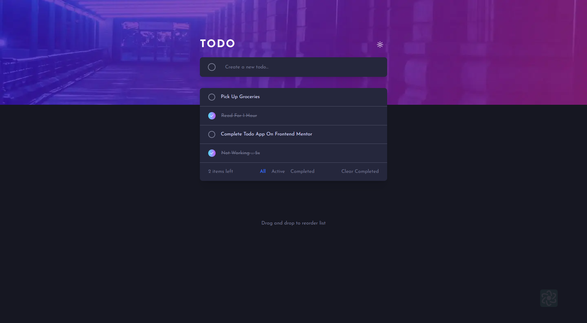

# Todo App

This project is a front-end coding challenge from [Frontend Mentor](https://www.frontendmentor.io). It aims to improve your coding skills by building realistic projects. The challenge is to develop a todo app according to the provided design, implementing various features using HTML, CSS, and JavaScript.

## Preview

## Features

-   View the optimal layout for the app depending on their device's screen size
-   See hover states for all interactive elements on the page
-   Add new todos to the list
-   Mark todos as complete
-   Delete todos from the list
-   Filter by all/active/complete todos
-   Clear all completed todos
-   Toggle light and dark mode
-   **Bonus**: Drag and drop to reorder items on the list

**Have fun exploring!** 🚀
